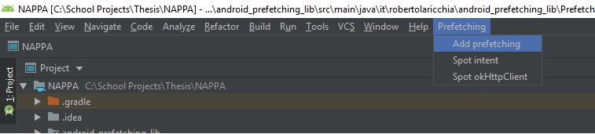

# NAPPA plugin for Android Studio

This project contains a plugin for Android Studio to automate the task of enabling NAPPA in an existing Android project.
This plugin injects all critical NAPPA dependencies to an Application’s source code. 

## Getting started

### Installation

* Go to this repository [releases](https://github.com/S2-group/NAPPA/releases) page.
* Download the latest version of the plugin from `NAPPA Plugin for Android Studio v1.x`.
* Open Android Studio.
* Go to `File > Settings > Plugins > Cog icon > Install plugin from disk` (see figure below).
* Select the downloaded file.
* Restart Android Studio.
* You should see a new entry in the menu bar named `Prefetching`. 

<p align="center">
   
</p>

To update the plugin, simply download a new version and repeat the process.

### Usage

There are four actions to inject NAPPA dependencies in the project source code (see figure below).
After the instrumentation process takes place, NAPPA performs the ENG construction dynamically.
Prefetching is performed transparently without requiring any intervention from the end-user.
As the user navigates an application's activities, the ENG is built and prefetching is performed whenever a suitable candidate is encountered.

<p align="center">
   
</p>

#### Instrument Activities

Searches for Android [Activity](https://developer.android.com/reference/android/app/Activity) classes to inject navigation probes.

Injected source-code:

```java
@Override
protected void onResume() {
    super.onResume();
    Nappa.setCurrentActivity(this);
}
```

#### Instrument Intent Extras

Searches for the usage of Android [Intent Extras](https://developer.android.com/reference/android/content/Intent) to inject extra probes.

Injected source-code:

```java
/* Source-code inject before the original source code */
Nappa.notifyExtras(intent.getExtras());

/* Original source-code */
startActivity(intent); 
```

#### Instrument OkHttpClient

Searches for usage of [OkHttpClient](https://square.github.io/okhttp/4.x/okhttp/okhttp3/-ok-http-client/) to instantiate a [OkHttp Interceptors](https://square.github.io/okhttp/interceptors/).
NAPPA serve intercepted requests whenever they are stored in the cache.
Otherwise, they are rerouted to the origin server. 

Injected source-code:

```java
/* Original source-code */
okHttpClient = new OkHttpClient();
okHttpClient = new OkHttpClient.Builder().build;

/* New source-code */
okHttpClient = Nappa.getOkHttp(new OkHttpClient());
okHttpClient = Nappa.getOkHttp(new OkHttpClient.Builder().build);
```

#### Instrument Retrofit

Searches for usage of [Retrofit](https://square.github.io/retrofit/) to provide an instrumented OkHttpClient.

Injected source-code:

```java
/* Original source-code */
retrofitClient = new Retrofit.Builder().client(new OkHttpClient())

/* New source-code */
retrofitClient = new Retrofit.Builder().client(Nappa.getOkHttp())
```

## Running the plugin in a local environment for development

### Required Tools

* [Gradle](https://gradle.org/) v5.6.4
* [IntelliJ IDEA](https://www.jetbrains.com/idea/)
* [Android Studio](https://developer.android.com/studio)

### Configuration

Create the file `gradle.properties` in the Gradle installation direcctory with the content:

``` text
nappaAndroidStudioHome=/absolute/path/to/Android Studio/
nappaAndroidStudioVersion=/build/version/of/Android Studio
```

To find the installed version of Android Studio, use the Android Studio `About` dialog screen. 
An example is shown below.
In this case, the (BRANCH. BUILD. FIX) version of the IntelliJ Platform is `191.8026.42`.
Refer to [Android Studio Plugin Development](https://www.jetbrains.org/intellij/sdk/docs/products/android_studio.html) for more details.

<p align="center">

</p>

Import this project in IntelliJ IDEA.

**Info**: If no property is defined, Gradle will download the latest build of IntelliJ IDEA Community Edition.

### Running the plugin

Running the plugin will open an instance of Android Studio with the plugin installed.
A few exceptions might take place when opening the Android Studio stance. 
The cause of these exceptions are undefined configurations (e.g. SDK) and can be ignored.

#### Running the plugin from IntelliJ IDEA

* Open the [Gradle tool window](https://www.jetbrains.com/help/idea/jetgradle-tool-window.html#).
* Double click on `nappa-plugin-android-studio > Tasks > IntelliJ > runIde`.
 
Running from the IntelliJ IDEA allows the plugin to be executed in debug mode. 

#### Running the plugin from bash

```bash
sudo sh ./gradlew runIde
```

### Create a new build

Gradle places new builds in the directory [build/distributions](build/distributions).

#### Create a new build from IntelliJ IDEA

* Open the [Gradle tool window](https://www.jetbrains.com/help/idea/jetgradle-tool-window.html#).
* Double click on `nappa-plugin-android-studio > Tasks > IntelliJ > buildPlugin`

#### Create a new build from bash

```bash
sudo sh ./gradlew buildPlugin
```

### Development

The official IntelliJ documentation on developing plugins is available [here](https://www.jetbrains.org/intellij/sdk/docs/intro/welcome.html).

Each instrumentation described above is implemented as an Action and are mapped in the [plugin.xml](src/main/resources/META-INF/plugin.xml#L29) file.

There is a set of utility libraries implemented to abstract common logic between the actions.

Changes in the source-code are not automatically pushed to the current instance of Android Studio.
The `runIde` command must be executed again to reflect the changes.
