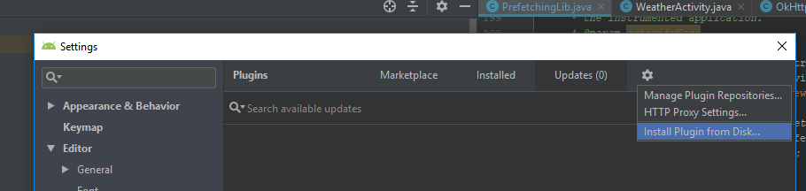
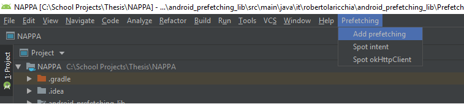

# NAPPA plugin for Android Studio

This project contains a plugin for Android Studio to automate the task of enabling NAPPA in an existing Android project.
This plugin injects all critical NAPPA dependencies to an Application’s source code. 

## Getting started

### Installation

* Go to this repository [releases](https://github.com/S2-group/NAPPA/releases) page.
* Download the latest version of the plugin from `Android Studio Plugin v1.x`.
* Open Android Studio.
* Go to `File > Settings > Plugins > Cog icon > Install plugin from disk` (see figure below).
* Select the downloaded file.
* Restart Android Studio.
* You should see a new entry in the menu bar named `Prefetching`. 

<p align="center">
	
</p>

To update the plugin, simply download a new version and repeat the process.

### Usage

There are four actions to inject NAPPA dependencies in the project source code, each described below.

<p align="center">
	
</p>

#### Instrument Activities

Searches for Android [Activity](https://developer.android.com/reference/android/app/Activity) classes to inject navigation probes.

Injected source-code:

```java
@Override
protected void onResume() {
    super.onResume();
    PrefetchingLib.setCurrentActivity(this);
}
```

#### Instrument Intent Extras

Searches for usage of Android [Intent Extras](https://developer.android.com/reference/android/content/Intent) to inject extra probes.

Injected source-code:

```java
PrefetchingLib.notifyExtras(intent.getExtras());

/* Original source-code */
startActivity(intent); 
```

#### Instrument OkHttpClient

Searches for usage of [OkHttpClient](https://square.github.io/okhttp/4.x/okhttp/okhttp3/-ok-http-client/) to instantiate a network interceptor.

Injected source-code:

```java
/* Original source-code */
okHttpClient = new OkHttpClient();
okHttpClient = new OkHttpClient.Builder().build;

/* New source-code */
okHttpClient = PrefetchingLib.getOkHttp(new OkHttpClient());
okHttpClient = PrefetchingLib.getOkHttp(new OkHttpClient.Builder().build);
```

#### Instrument Retrofit

Searches for usage of [Retrofit](https://square.github.io/retrofit/) to instantiate a network interceptor.

Injected source-code:

```java
/* Original source-code */
retrofitClient = new Retrofit.Builder().client(new OkHttpClient())

/* New source-code */
retrofitClient = new Retrofit.Builder().client(PrefetchingLib.getOkHttp())
```

## Run the project locally


INSTRUCTIONS

Build plugin with

./gradlew buildPlugin

The plugin binaries can be found in 

build/distributions

Install Plugin in Android Studio:

File -> Settings -> Plugins -> Install plugin from disk

Restart Android Studio.

In the main bar you will found a new Menu called "Prefetching"

Use "Spot intent" to instrument intents in order to get Intent arguments
Use "Spot OkHttp" to instrument OkHttp Builder in order to track HTTP/GET requests
use "Add prefetching" to instrument Activities in orer to get the navigation graph

## Build

In order to enable prefetching with NAPPA, an instrumentation process must take place at development time. 
This task is performed via a plugin which can be installed in Android Studio in order to inject all critical NAPPA dependencies to an Application’s source code. 

### Requirements

Currently, NAPPA makes use of [OkHTTP3 interceptors](https://github.com/square/okhttp/wiki/Interceptors) in order to intercept HTTP requests performed by the end-user.  
Intercepted requests are served by NAPPA whenever they are stored in the cache.  
Otherwise, they are rerouted to the origin server. 

### Installing the Plug-in

In order to Install the [plug-in](https://github.com/S2-group/NAPPA/tree/master/Plugin/test1) in android studio, please take the following steps:

In order to Install the in android studio, please take the following steps:
Build the plugin with
`./gradlew buildPlugin ` 
The plugin binaries can be found in
`build/distributions` 
Install Plugin in Android Studio:
File -> Settings -> Plugins -> Install plugin from disk
Restart Android Studio. 


### Instrumentation

In the main bar you will found a new Menu called "Prefetching"


 
Use "Spot intent" to instrument intents in order to get Intent arguments
Use "Spot OkHttp" to instrument OkHttp Builder in order to track HTTP/GET requests
use "Add prefetching" to instrument Activities in order to get the navigation graph

After the instrumentation process takes place, NAPPA performs the ENG construction dynamically. 
Prefetching is performed transparently without requiring any intervention from the end user.  
As the user navigates an application's activities, the ENG is built and prefetching is performed whenever a suitable candidate is encountered.

### Set up local environment for development

#### Android Studio Plugin

Install the following toos:

* [Gradle](https://gradle.org/)
* [IntelliJ IDEA](https://www.jetbrains.com/idea/)
* [Android Studio](https://developer.android.com/studio)

Create the file `gradle.properties` in the Gradle installation direcctory with the content:

``` text
nappaAndroidStudioHome=/absolute/path/to/Android Studio/
nappaAndroidStudioVersion=/build/version/of/Android Studio
```

To find which version of Android Studio is installed, use the Android Studio `About` dialog screen. 
An example is shown below.
In this case, the (BRANCH. BUILD. FIX) version of the IntelliJ Platform is `191.8026.42` .
Refer to [Android Studio Plugin Development](https://www.jetbrains.org/intellij/sdk/docs/products/android_studio.html) for more details.

<p align="center">

</p>

Import the directory [Plugin/test1/](Plugin/test1/) in InteliJ IDEA

Open the [Gradle tool window](https://www.jetbrains.com/help/idea/jetgradle-tool-window.html#)

Click on `test1 > Tasks > IntelliJ > runIde` to open an instance of Android Studio with the plugin installed. 
This instance can be run in debug mode.
Note that changes in the source code require running the command again to take effect. 