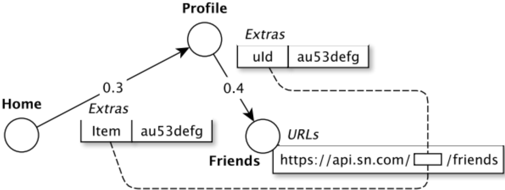
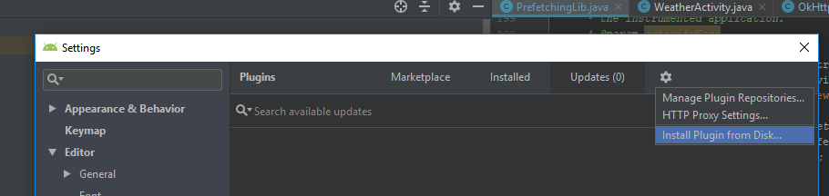
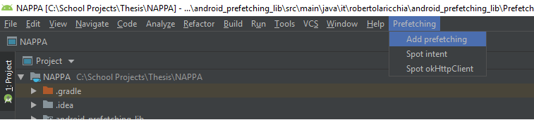

# NAPPA
Implementation of a navigation-aware technique for personalized prefetching of network requests of Android apps.
A description of the internals of the NAPPA approach is available in our [ICSE 2019 publication](http://www.ivanomalavolta.com/files/papers/ICSE_2019_NAPPA.pdf).  

## Introduction
In order to perform a Navigation-Aware prefetching, NAPPA introduces the notion of an Extended Navigation Graph.  This graph is built by letting nodes represent activities,  and all edges represent activity transitions within the application. The ENG plays a central role in the prefetching process by exposing prefetch enabled URLs  ( **What** ) and by keeping track of which prefetch enabled URL Candidates are most likely to be accessed in subsequent activity transitions ( **When**).

 <p align="center">
 
 </p>

An URL may be composed of both static components (for example the domain name and path) and also  dynamic components (such as URL parameters).  The ENG addresses the challenge of identifying dynamic URL components by capturing [intent extras](https://developer.android.com/reference/android/content/Intent) between activity transitions.   Whenever an HTTP Request is performed,  NAPPA verifies if any of the extras captured on previous activity transitions corresponds to an URL component.  If so,  an association between an extra and its corresponding static URL components is created—this becomes a prefetch enabled URL candidate. 

## Build
In order to enable prefetching with NAPPA,  an instrumentation process must take place at development time. This task is performed via a plugin which can be installed in Android Studio in order to inject all critical NAPPA dependencies to an Application’s source code. 

### Requirements
Currently, NAPPA makes use of [OkHTTP3 interceptors](https://github.com/square/okhttp/wiki/Interceptors) in order to intercept HTTP requests performed by the end-user.  Intercepted requests are served by NAPPA whenever they are stored in the cache.  Otherwise, they are rerouted to the origin server. 

### Installing the Plug-in
In order to Install the [plug-in](https://github.com/S2-group/NAPPA/tree/master/Plugin/test1) in android studio, please take the following steps:

In order to Install the in android studio, please take the following steps:
Build the plugin with
`./gradlew buildPlugin `
The plugin binaries can be found in
`build/distributions`
Install Plugin in Android Studio:
File -> Settings -> Plugins -> Install plugin from disk
Restart Android Studio. 

<p align="center">

</p>

### Instrumentation
In the main bar you will found a new Menu called "Prefetching"

 <p align="center">
 
 </p>
 
Use "Spot intent" to instrument intents in order to get Intent arguments
Use "Spot OkHttp" to instrument OkHttp Builder in order to track HTTP/GET requests
use "Add prefetching" to instrument Activities in order to get the navigation graph

After the instrumentation process takes place, NAPPA performs the ENG construction dynamically. Prefetching is performed transparently without requiring any intervention from the end user.  As the user navigates an application's activities, the ENG is built and prefetching is performed whenever a suitable candidate is encountered.
## How to cite NAPPA
If NAPPA is helping your research, consider to cite is as follows, thanks!

```
@inproceedings{ICSE_2019_NAPPA,
	author = {Ivano Malavolta and Francesco Nocera and Patricia Lago and Marina Mongiello},
	month = {May},
	title = {{Navigation-aware and Personalized Prefetching of Network Requests in Android Apps}},
	booktitle = {Proceedings of the 41st ACM/IEEE International Conference on Software Engineering},
	year = {2019},
 	location = {Montreal, Canada},
 	numpages = {4},
 	publisher = {IEEE Press},
	url = {http://www.ivanomalavolta.com/files/papers/ICSE_2019_NAPPA.pdf}
}
```

## License

This software is licensed under the MIT License.
